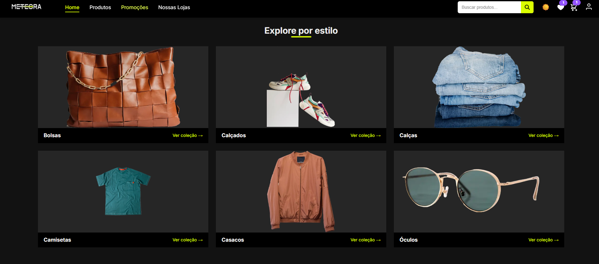

# Meteora



## 📖 Sobre

**Meteora** é um e-commerce de moda desenvolvido com Next.js 15 (App Router). A loja permite navegar por categorias, explorar um catálogo completo com filtros e ordenação, buscar produtos com tolerância a acentos e erros de digitação, favoritar itens, montar o carrinho e finalizar o pedido com cupons de desconto.

O projeto explora, de forma prática, as diferentes estratégias de renderização do Next.js — **SSG**, **ISR**, **SSR** e **CSR** — numa mesma aplicação, com dados persistidos em **PostgreSQL**, tema claro/escuro, layout responsivo e metadados otimizados para SEO e redes sociais.

---

## ✨ Funcionalidades

O **Meteora** oferece uma experiência de compra completa:

- 🏠 **Home**
  - Grid editorial de categorias ("Explore por estilo") e vitrine de produtos em destaque.
  - Prova social com as melhores avaliações, newsletter com cupom de boas-vindas e faixa de benefícios (frete, troca, pagamento seguro, parcelamento).

- 🛍️ **Catálogo (`/produtos`)**
  - Listagem com filtros por categoria, cor, tamanho e faixa de preço, além de ordenação e paginação.
  - Os filtros ficam na URL (`/produtos?categoria=1&ordenar=price_asc`): link compartilhável, F5 preserva a seleção e o voltar desfaz a escolha.
  - Chips de filtros ativos com remoção individual.

- 👕 **Página de Produto (`/produto/[id]`)**
  - Detalhe com galeria, cores/tamanhos, preço e desconto.
  - Avaliações com estrelas (média calculada no banco) e seção de produtos relacionados.

- 🔎 **Busca Inteligente**
  - Barra de busca fixa no header e página `/search` dedicada.
  - Tolerante a acentos, caixa e pequenos erros de digitação (`unaccent` + `pg_trgm` no PostgreSQL), com termo sincronizado na URL.

- 🛒 **Carrinho e Checkout**
  - Sacola persistida no navegador (Context API + `localStorage`), com badge de quantidade no header.
  - Checkout com aplicação de cupons de desconto; o pedido é gravado no PostgreSQL.

- ❤️ **Favoritos (`/favoritos`)**
  - Salve os produtos que quer acompanhar; a lista é persistida no navegador.

- 👤 **Conta e Autenticação (mockada)**
  - Login demonstrativo (Context + `localStorage`) com histórico de pedidos em `/conta` e menu de conta no header.

- 🌗 **Tema Claro/Escuro**
  - Alternância de tema com preferência salva e sem flash ao carregar.

- ⚡ **SSG / ISR / SSR / CSR e SEO**
  - Categorias e páginas de produto pré-renderizadas; produtos da home com revalidação (ISR); catálogo dinâmico (SSR); busca no cliente (CSR).
  - Metadados dinâmicos com Open Graph e Twitter Cards.

- 🛡️ **Robustez de API**
  - Validação de query params e bodies com **Zod** (retornando `400`), rate limiting na busca pública (`429`) e pool de conexões resiliente.

- 📱 **Experiência Responsiva**
  - Layout adaptado para desktop e mobile, header sticky com menu colapsável e busca acessível em qualquer tela.

---

## 🚀 Tecnologias Utilizadas

- **[Next.js 15](https://nextjs.org/)** (App Router + Turbopack): Framework React com SSR/SSG/ISR e roteamento por arquivos.
- **[React 19](https://react.dev/)**: Server e Client Components.
- **[PostgreSQL 16](https://www.postgresql.org/)** (local via Docker): Banco de dados relacional.
- **[node-postgres (`pg`)](https://node-postgres.com/)**: Driver de acesso ao banco.
- **[Zod](https://zod.dev/)**: Validação de query params e bodies nas rotas de API.
- **[Vitest](https://vitest.dev/) + [Testing Library](https://testing-library.com/)**: Testes unitários (data-layer e hooks).
- **CSS Modules**: Estilização modular.
- **Google Fonts** (Inter) via `next/font`.

---

## ⚙️ Como Executar o Projeto

Siga os passos abaixo para rodar o projeto em seu ambiente de desenvolvimento.

### Pré-requisitos

- [Node.js](https://nodejs.org/en) (versão 20 ou superior)
- [npm](https://www.npmjs.com/)
- [Docker](https://www.docker.com/) + Docker Compose (para o PostgreSQL local)
  - _Alternativa:_ um PostgreSQL instalado localmente

### Passos

1. **Clone o repositório:**
   ```bash
   git clone https://github.com/rodrisoares/meteora-ecommerce.git
   ```

2. **Acesse o diretório do projeto:**
   ```bash
   cd meteora-ecommerce
   ```

3. **Instale as dependências:**
   ```bash
   npm install
   ```

4. **Configure as variáveis de ambiente:**
   ```bash
   cp .env.example .env.local
   ```
   > O `.env.local` já vem com a `DATABASE_URL` apontando para o Postgres do Docker (porta **5433**).

5. **Suba o banco PostgreSQL (cria as tabelas automaticamente):**
   ```bash
   docker compose up -d
   ```

6. **Popule o banco com os dados iniciais:**
   ```bash
   npm run seed
   ```

7. **Execute a aplicação:**
   ```bash
   npm run dev
   ```

A aplicação estará disponível em `http://localhost:3000` (ou em outra porta, caso a 3000 esteja em uso).

> **Sobre o `seed`:** os dados vivem em um volume Docker na sua máquina (não são compartilhados). Rode `npm run seed` em um clone novo, após apagar o volume (`docker compose down -v`) ou sempre que o schema mudar. Ele recria as tabelas (categorias, produtos, avaliações, pedidos) e popula os dados de exemplo.

---

## 📜 Scripts

| Script                | O que faz                                              |
| --------------------- | ------------------------------------------------------ |
| `npm run dev`         | Servidor de desenvolvimento (Turbopack)                |
| `npm run build`       | Build de produção                                      |
| `npm run build:clean` | Build removendo o cache do `.next` antes               |
| `npm run start`       | Serve o build de produção localmente                   |
| `npm run seed`        | Cria as tabelas e popula os dados iniciais             |
| `npm run lint`        | ESLint em todo o projeto                               |
| `npm test`            | Roda a suíte de testes (Vitest) uma vez                |
| `npm run test:watch`  | Testes em modo watch                                   |

---

